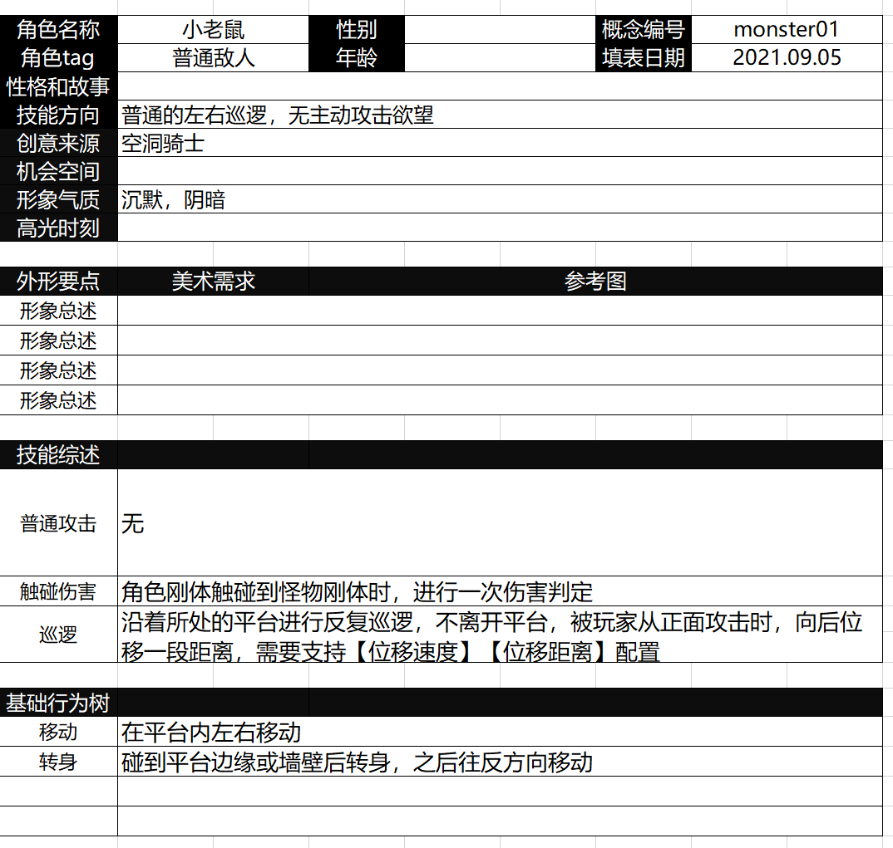
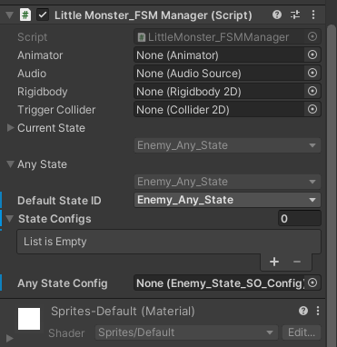
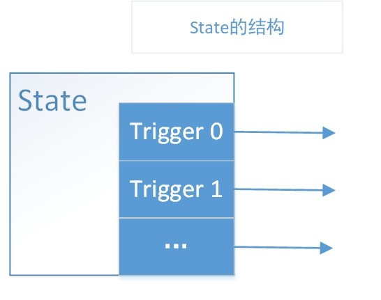
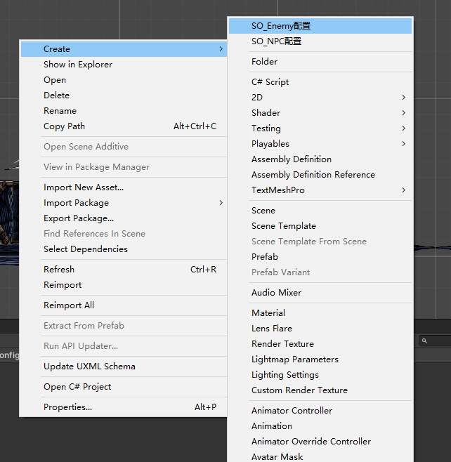
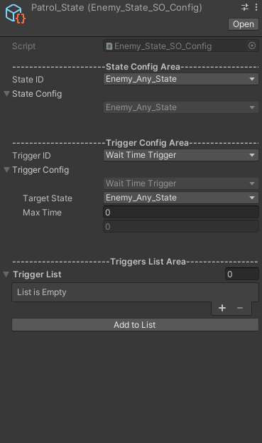
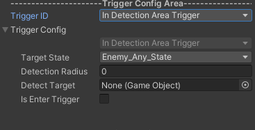
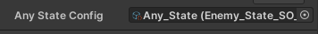

# FSM ScriptableObject 配置状态功能

状态机若用代码直接配置也不是不可以，但是不够直观，复用程度也不高，于是这里建议使用ScriptableObject直接在Inspector进行状态配置。

接下来我会从使用者的角度介绍这套状态机的SO配置方法。

### 使用教程

从案例中学习是最直观的，我们就直接利用这套配置方法来搭一个状态机。

这里我们要搭一个怪物，需求如下

 在进行SO配置之前，我们需要对需求进行抽象，脑海中有一个清晰的状态机，我们可以从这个需求中抽象出这么一个状态机，用图画出来长这样。

在该FSM中，State和trigger是进行过解耦的，所以我们要做的十分简单，接下来就是搭积木了。

#### 搭积木

首先需要确认我们有积木储备先，即有关的State和Trigger的功能写好了，并在FSMenum文件中进行了注册。

##### 第一步：给目标对象挂载上对应的FSMManager

可以看到有如下结构，如果我们使用SO配置的话，只需要关注State Configs 和Any State Config这两栏就好。

**State Configs**  是所有状态列表，对象的状态就在这个列表中的状态进行切换。

**Any State Config** 是一些任意状态都会执行的行为，如果有需求说无论在哪个状态都需要进行的动作，可以添加在这里，一般用于全局的状态切换，对应如上的AnyState。

那么有人就要问了，这里只是设置了状态，那么状态之间的切换箭头要在哪里配置呢？这个将在State的SO配置文件中配置。

##### 第二步：建立State_SO配置文件

在该套状态机中，State之间的切换是由Trigger进行的，即状态的抽象长这样：

所以说我们要在State的SO配置文件中配置状态的行为和该状态的TriggerList。

在空白处右键，Creat可生成SO配置文件。

可以看到，State配置文件分成三部分

**State Config Area:**状态参数设置，可以在这里设置有关这个状态所执行的具体状态，并配置参数。

调整**StateID**可以任意选择对应的State，然后可以在**State Config**栏中对状态参数进行配置。

**Trigger Config Area**也是同理。

调整**TriggerID**可以任意选择需要的Trigger，然后可以在**Trigger Config**栏中对状态参数进行配置。

**Target State**为必配置的，它指示这个Trigger触发时切换到的状态。

在配置好当前的Trigger之后，只需点击最下面的**Add to List**按钮就可以把配置好的Trigger添加到**Tirgger List**当中。

在该例子中，我们需要配置四个 State的SO配置文件

包括三个切换的状态和一个AnyState

##### 第三步：挂载SO_State文件到FSM_Manager中

我们只需要在State Configs 这个List和Any State Config添加State的SO配置文件，就可以实现功能了。

**具体例子可参考General_FSM分支**