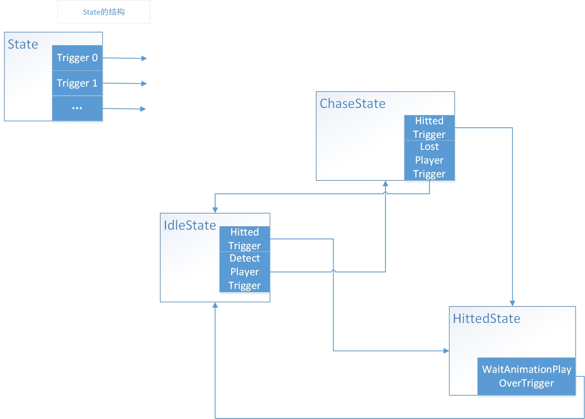
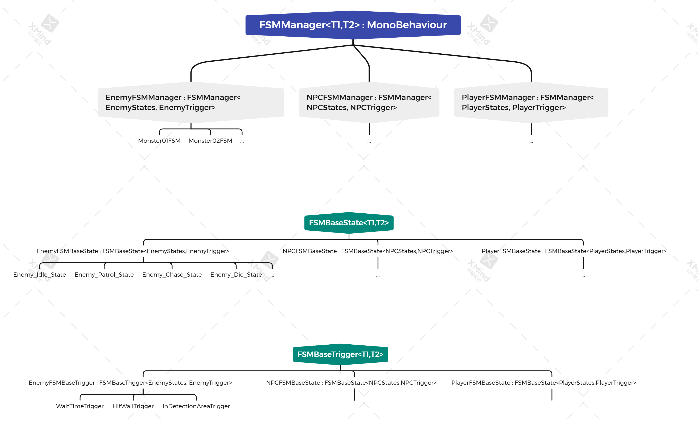

# FSM框架的基本原理及使用方法

#### 有限状态机(FSM)

FSM在游戏中得到十分广泛的应用，一切需要状态切换的游戏对象都可以利用状态机来进行状态配置。如图表示：



状态机的原理大家应该十分熟悉了，就不再赘述。在该项目中，状态机的基本单元就是各个状态。状态的抽象

如图：


**在该项目中，我们将状态的行为和切换状态的条件分离开来，以便配置。**


#### 该项目中FSM的类继承视图

**我们为了一套FSM用整个项目，即需要一套状态机的基类衍生出各类状态机，比如EnemyFSM，PlayerFSM, NPCFSM。这里利用泛型来实现多态。**




**这边建议从第二层开始继承**


#### 基类的有关可调用，可重写的方法


### 一些注意事项

#### Attention 00：

**由于可配置性的需求，建议将所需的参数放在State内部或Trigger内部，降低这三者的耦合度，以实现像拼积木一样能自由配置的能力。**

**PS:有提供SO配置的相关功能，需要使用的话可以参考Enemy_State_SO_Config代码的实现，并且需要在继承FSMManager中重写InitWithScriptableObject()方法，参考EnemyFSMManager的重写。**


#### Attention 01：

<u>**若要构建第二层的中间类，在继承基类时，T1,T2必须均为枚举类型，其中T1为State枚举，T2为Trigger枚举。**</u>

<u>**例如：**</u>

```csharp
public enum EnemyStates
{
    Enemy_Idle_State,
    Enemy_Patrol_State,
	...
}

public enum EnemyTrigger
{
    WaitTimeTrigger,
    HitWallTrigger,
    InDetectionAreaTrigger
}
public class EnemyFSMManager : FSMManager<EnemyStates, EnemyTrigger> {  }

public class EnemyFSMBaseTrigger : FSMBaseTrigger<EnemyStates, EnemyTrigger> 
{
    public EnemyFSMBaseTrigger(EnemyStates targetState):base(targetState){ }
    public EnemyFSMBaseTrigger(){ }
}
public class EnemyFSMBaseState : FSMBaseState<EnemyStates,EnemyTrigger> {}

```

**以上的例子是构建出EnemyFSM的一套基类，以后凡是有关Enemy的所有State,Trigger，FSMManager，都可以由这三个类作为基类来继承。**


#### Attention 02：

<u>**在构建出一个类之后，必须在对应的枚举中注册该类，且类名与枚举名保持一致**</u>

**例如：**

```csharp
public class Enemy_Idle_State : EnemyFSMBaseState
{
    public override void Act_State(FSMManager<EnemyStates, EnemyTrigger> fSM_Manager)
    {
        fsmManager = fSM_Manager;
    }
    public override void EnterState(FSMManager<EnemyStates, EnemyTrigger> fSM_Manager)
    {
        fSM_Manager.GetComponent<Rigidbody2D>().velocity = Vector3.zero;
    }
    protected override void InitState()
    {
        base.InitState();
    }
}

public enum EnemyStates
{
    Enemy_Idle_State//对Enemy_Idle_State这个类的注册。
}
```


